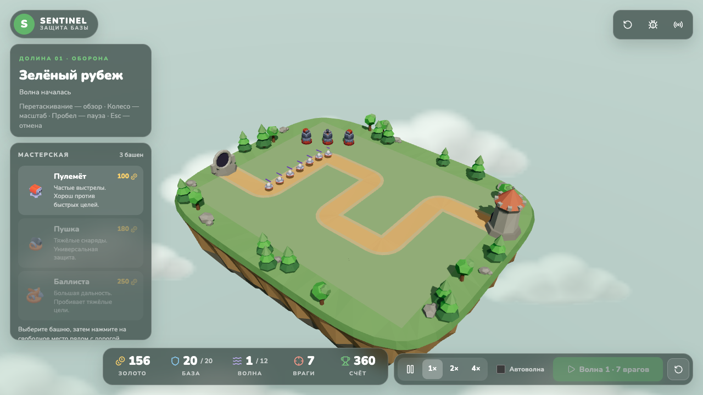

# Sentinel

Браузерный tower defense на three.js: двенадцать волн НЛО против трёх типов башен на парящем низкополигональном острове.



## Механика

- **Волны.** 12 волн. С каждой волной тарелок больше, со второй появляются перехватчики, с третьей — тяжёлые НЛО. Здоровье врагов растёт на 18 % за волну. Между волнами 20 секунд, можно включить автозапуск. База выдерживает 20 единиц урона.
- **Экономика.** Старт — 500 золота. Награда за врага: тарелка 12, перехватчик 14, тяжёлый НЛО 38; за отбитую волну — 50 + 10 × номер волны. Улучшение до третьего уровня стоит 70 % и 110 % цены башни и даёт урон ×1.6 и ×2.5, дальность +0.65 за уровень, скорострельность +20 % за уровень. Продажа возвращает 70 % вложенного.
- **Приоритет цели** у каждой башни: ближе к базе, ближе к башне, самый сильный, самый слабый.

| Башня | Цена | Урон | Выстрелов/с | Дальность | Против кого |
| --- | ---: | ---: | ---: | ---: | --- |
| Пулемёт | 100 | 8 | 4 | 4.4 | Быстрые перехватчики: частые выстрелы не дают им проскочить |
| Пушка | 180 | 45 | 0.85 | 5.4 | Универсальная защита на средней дистанции |
| Баллиста | 250 | 130 | 0.34 | 9 | Тяжёлые НЛО: большой урон и дальность |

Числа берутся из `src/game/config/balance.ts`; там же волны и характеристики врагов.

## Управление

- Выберите башню в мастерской и нажмите на свободную клетку рядом с дорогой. Зелёный контур — можно строить, красный — нельзя.
- Нажмите на построенную башню, чтобы улучшить, продать или сменить приоритет цели.
- Перетаскивание — вращение камеры, колесо мыши или жест двумя пальцами — масштаб. Пробел — пауза, Esc — отмена строительства. Кнопки 1× / 2× / 4× меняют скорость.

## Установка и запуск

Нужен Node.js 22.12 или новее.

```sh
npm install
npm run dev
```

Откройте http://127.0.0.1:5173. Сервер для игры не требуется.

Серверная часть (таблица результатов и трансляции) необязательна. Скопируйте `.env.example` в `.env`, задайте `DATABASE_URL` и случайный `JWT_SECRET` длиной не менее 32 символов, затем:

```sh
docker compose -p sentinel-td up -d postgres
npm run db:generate
npm run db:migrate
npm run dev:all
```

Проверки: `npm test` — тесты движка, раскладки острова и облаков; `npm run typecheck`; `npm run build` — production-сборка в `dist/`.

## Стек

- React 19, TypeScript, Vite.
- three.js, React Three Fiber, drei; Redux Toolkit; Radix UI Dialog; Tailwind CSS.
- Сервер: Express 5, Prisma + PostgreSQL, Socket.IO, zod, JSON Web Token.
- Тесты: `node:test` через tsx.

Игровая логика (`src/game`) не зависит от React и three.js; сцена и интерфейс читают её состояние. Остров, дорога, облака и небо построены процедурно; башни, НЛО и снаряды — модели из Kenney Tower Defense Kit (см. [ASSETS.md](ASSETS.md)).

## Лицензия

Код распространяется по лицензии [MIT](LICENSE). Модели Kenney Tower Defense Kit — CC0.
